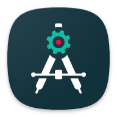

<p align="center">
  
</p>

<h1 align="center">AndroidPE</h1>

<p align="center">
  <strong>Android Programming Environment</strong> &mdash; Your IDE in your pocket !
</p>

<p align="center">
  A multi-language, modular IDE for Android that supports project creation, editing,
  compilation, and preview &mdash; all directly from your mobile device.
</p>

<div align="center">
  <!-- Status -->
  
  
  

  <!-- Build -->
  
  

  <!-- Features -->
  
  

  <!-- Community -->
  

  <!-- License -->
  
  

  <!-- Stars -->
  
</div>

---

## ✨ Features

### 🖥️ Code Editor
- Syntax highlighting via TextMate grammars + TreeSitter
- In-process LSP for instant autocompletion across 10+ languages
- Color preview for hex values
- Multi-cursor, search & replace, undo/redo
- File explorer with tabbed navigation

### 🎨 Visual Editors & Previewers
- **Layout UI Designer** &mdash; WYSIWYG drag-&amp;-drop for Android XML layouts
- **Assets Studio** &mdash; Vector drawable editor
- **Menu Item Designer** &mdash; XML menu editor
- **Resource Values Modifier** &mdash; Edit colors, dimens, strings, integers
- **HTML Previewer** &mdash; Live HTML rendering
- **Markdown Previewer** &mdash; Rendered markdown preview

### 🌐 Multi-Language LSP Support

| Language | LSP Engine |
|----------|------------|
| Java / Kotlin | In-process ([jk-lang-server](https://github.com/jkasdbt/jk-lang-server)) |
| Python | pyLSP |
| Dart / Flutter | Dart analysis server |
| Rust | rust-analyzer |
| C / C++ | clangd |
| JavaScript / TypeScript | TypeScript Language Server |
| HTML / CSS | vscode-html / vscode-css |
| Bash / Shell | bash-language-server |

### 📦 Project Templates
- **Android** &mdash; Gradle, multi-module, NDK 64-bit
- **Flutter / Dart**
- **Python**
- **Web** &mdash; HTML + CSS + JS/TS
- **Rust**
- **Terminal Scripts** &mdash; Bash, Shell

### 🗃️ Project Management
- Multi-module support
- Module dependency management
- Activities, Permissions, Services configuration
- File explorer with tree view

### 🖥️ Terminal
- Embedded Linux rootfs (Ubuntu-based)
- Full shell access within the app

### 🔧 Build System
- Gradle-based Android project compilation
- Latest Android tools &amp; SDK support
- NDK (64-bit only)

---

## ⚙️ Setup & Configuration

### First launch
On first installation, AndroidPE automatically downloads and installs the necessary
base assets (icons, drawables, TextMate grammars) and the Linux rootfs for the
terminal. After this initial setup, the application is fully usable for all
basic features without any additional installation.

### Enable advanced features (autocompletion, compilation, diagnostics)
Open a **new terminal session** inside the app and run:

```bash
rkb setup ide
```

This command downloads and configures everything needed for the IDE to function
at full capacity: JDK, Android SDK, LSP servers, and all required toolchains.

### Optional: NDK
If you need native (C/C++) compilation support:

```bash
rkb install ndk
```

Then choose the target NDK version when prompted.

### Optional: Flutter / Dart
```bash
rkb setup flutter
# NDK installation is required.
```

Approximately 2 GB of data will be downloaded.

### Upgrading from an older version
Users who used AndroidPE before the Kotlin LSP update should run:

```bash
rkb update
```

This command checks all installed tools for updates and installs any missing
components.

---

## 🚧 Status

AndroidPE is under **active development**. The codebase is being restructured and cleaned up.
The source code will be published in its entirety once the project reaches a more stable
and well-organized state. Stay tuned!

---

## 👥 Community

Join us on Telegram for early tests, feature previews, updates and more:  
👉 **https://t.me/AndroidPEOfficial**

---

## 🧾 License

```
AndroidPE - Android Programming Environment

AndroidPE is free software: you can redistribute it and/or modify
it under the terms of the GNU General Public License as published by
the Free Software Foundation, either version 3 of the License, or
(at your option) any later version.

AndroidPE is distributed in the hope that it will be useful,
but WITHOUT ANY WARRANTY; without even the implied warranty of
MERCHANTABILITY or FITNESS FOR A PARTICULAR PURPOSE.  See the
GNU General Public License for more details.

You should have received a copy of the GNU General Public License
along with AndroidPE.  If not, see <https://www.gnu.org/licenses/>.
```
